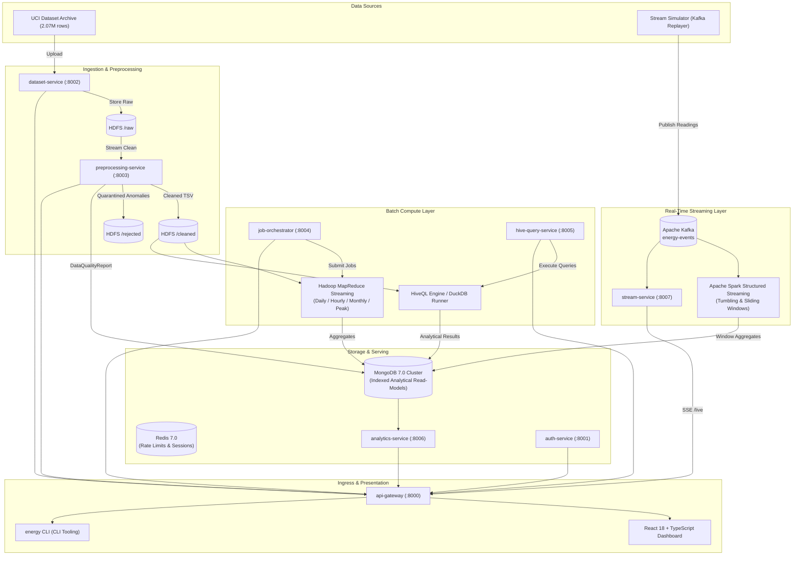

# Big Data Energy Consumption Analytics Platform

[-blue.svg)](#architecture)
[](#kubernetes--helm-deployment)
[](#compute--analytical-pipelines)
[](#security--rbac-architecture)
[-brightgreen.svg)](#testing--verification)
[-success.svg)](#independent-analytics-correctness-verification)

A production-grade, Kubernetes-native, microservices-based Big Data Energy Consumption Analytics Platform built on the UC Irvine **Individual Household Electric Power Consumption** dataset (~2,075,259 observations sampled at 1-minute intervals).

This platform combines batch processing (**HDFS**, **Hadoop MapReduce**, **Apache Hive**) with real-time streaming (**Apache Kafka**, **Apache Spark Structured Streaming**, **Server-Sent Events**), backed by **MongoDB 7.0**, **Redis 7.0**, a **React 18 + TypeScript + Vite** frontend, and a hardened **Python CLI**.

---

## 1. High-Level System Architecture



---

## 2. Microservice Topology & Port Inventory

Every microservice is built with FastAPI, runs in a dedicated non-root container (`UID 10001`), and exposes Prometheus metrics at `/metrics` and health probes at `/health`.

| Service | Port | Primary Responsibilities | Data Store / Ingress |
| :--- | :---: | :--- | :--- |
| **api-gateway** | `8000` | Ingress reverse proxy, token validation, rate-limiting (Redis token bucket), security headers (CSP, HSTS, X-Frame-Options), correlation ID injection (`X-Correlation-ID`). | Redis, Upstream Services |
| **auth-service** | `8001` | User identity, PBKDF2/Argon2id password hashing, RS256/HS256 JWT access tokens (15m expiry) and refresh tokens (7d), RBAC (`ADMIN`, `ANALYST`, `VIEWER`), audit logs. | MongoDB (`users`, `audit_logs`) |
| **dataset-service** | `8002` | Multipart upload, SHA-256 integrity verification, schema validation, persistence to raw HDFS (`/user/bda/energy/raw`), dataset metadata tracking. | HDFS, MongoDB (`datasets`) |
| **preprocessing-service** | `8003` | Streaming memory-bounded cleaning, isolation of `'?'` missing values to `/rejected`, timestamp parsing, physical boundary checks ($V \in [180, 270]$, $kW \ge 0$), DataQualityReport. | HDFS, MongoDB (`data_quality_reports`) |
| **job-orchestrator** | `8004` | MapReduce job dispatching, run lifecycle tracking (`PENDING`, `RUNNING`, `COMPLETED`, `FAILED`), deterministic Run ID deduplication, execution metrics, MongoDB sink. | HDFS, Hadoop CLI, MongoDB (`analytics_jobs`) |
| **hive-query-service** | `8005` | Parameterized HiveQL query engine, injection prevention, AST validation against approved templates, DuckDB vector execution engine over HDFS cleaned TSV data, latency telemetry. | HDFS, DuckDB, MongoDB (`hive_queries`) |
| **analytics-service** | `8006` | High-throughput analytical read models: system KPIs, daily/hourly/monthly consumption trends, peak power alerts, appliance sub-meter breakdowns, CSV/JSON exports. | MongoDB (`daily_aggregates`, etc.) |
| **stream-service** | `8007` | High-speed telemetry ingestion, historical replay simulator, 1-minute tumbling & 5-minute sliding window aggregations, active anomaly detection, Server-Sent Events (SSE). | Kafka, MongoDB (`stream_windows`) |

---

## 3. Quickstart & Local Development

### 3.1 Prerequisites
- **Python**: 3.11+
- **Node.js**: 18+ and `npm`
- **Docker & Compose**: (Optional, for multi-container evaluation)

### 3.2 Setup & Dependencies
```bash
# Clone the repository
git clone https://github.com/bda-org/energy-platform.git
cd bda

# Create and activate virtual environment
python -m venv venv
.\venv\Scripts\Activate.ps1    # On Windows
# source venv/bin/activate    # On Linux/macOS

# Install dependencies
pip install -r requirements.txt
```

### 3.3 Start the Unified Development Gateway
To start all 8 microservice routers on port `8000` with 1 command:
```bash
python scripts/dev_server.py
```
- Interactive Swagger UI: `http://localhost:8000/docs`
- Health check: `http://localhost:8000/health`

Default Credentials:
- **Admin**: `admin@bda-energy.internal` / `AdminPass123!`
- **Analyst**: `analyst@bda-energy.internal` / `AnalystPass123!`

### 3.4 Start the Web Dashboard
```bash
cd frontend
npm install
npm run dev
```
Open `http://localhost:5173` in your browser.

---

## 4. Platform CLI Tooling (`energy.bat` / `cli/main.py`)

A full-featured command-line interface provides operators with complete administrative and data pipeline control:

```bash
# Health & Diagnostics
energy health
energy diagnostics

# Generate high-fidelity synthetic benchmark dataset
python scripts/generate_sample_data.py --output data/sample_data.txt --days 14

# Dataset Management
energy dataset import data/sample_data.txt
energy dataset preprocess ds-sample-1234

# Batch Computing: MapReduce Jobs
energy mapreduce run ds-sample-1234 --job daily
energy mapreduce run ds-sample-1234 --job hourly
energy mapreduce run ds-sample-1234 --job peak --threshold 5.0

# Batch Computing: HiveQL Queries
energy hive query ds-sample-1234 --template daily_aggregates --limit 10
energy hive query ds-sample-1234 --template voltage_intensity_correlation

# Real-Time Streaming Controls
energy stream start --interval 100
energy stream status
energy stream stop
```

---

## 5. Compute & Analytical Pipelines

### 5.1 Hadoop MapReduce Architecture (`jobs/mapreduce/`)
Pure Python UNIX standard I/O streaming mappers and reducers compatible with Hadoop Streaming:
- **Daily Job (`daily/`)**: Computes total daily kWh ($\sum \frac{P_{kW}}{60}$), min/max/average power, and kitchen/laundry/climate Wh.
- **Hourly Job (`hourly/`)**: Aggregates diurnal 24-hour profile (00:00 to 23:00) with average voltage and load.
- **Monthly Job (`monthly/`)**: Produces long-term multi-year consumption and seasonal trends.
- **Peak Job (`peak/`)**: Detects high-power events exceeding threshold ($\ge 5.0\text{ kW}$) with appliance attribution.

### 5.2 Apache HiveQL Analytical Engine (`data-platform/hive/`)
Pre-defined HiveQL analytical queries validated against injection:
1. `01_daily_aggregates.hql`: Daily energy rollups and active energy calculations.
2. `02_hourly_profile.hql`: 24-hour diurnal profile and baseline load.
3. `03_monthly_trends.hql`: Monthly aggregated energy demand.
4. `04_peak_power_detection.hql`: Outlier peak demand spikes ($>95\text{th}$ percentile).
5. `05_appliance_energy_breakdown.hql`: Sub-meter 1, 2, 3 vs unmeasured residual consumption.
6. `06_voltage_intensity_correlation.hql`: Electrical P-V-I relationship verification.

### 5.3 Apache Spark Structured Streaming (`jobs/streaming/`)
Consumes Kafka topic `energy-events`, enforces 10-minute watermarking for late-arriving events, computes 1-minute tumbling and 5-minute sliding windows, and executes idempotent batch upserts to MongoDB.

---

## 6. Independent Analytics Correctness Verification (Req 50)

To mathematically prove analytics correctness, the platform provides an independent triangulation script comparing:
$$\text{Local Pure Math Baseline} \equiv \text{Hadoop MapReduce} \equiv \text{Apache HiveQL}$$

```bash
python tests/correctness/verify_analytics.py
```

### Verification Results Matrix:
```
=========================================================================================
          ANALYTICS CORRECTNESS TRIANGULATION MATRIX (Requirement 50)                    
=========================================================================================
Date         | Metric     | Local Baseline | MapReduce      | HiveQL         | Delta     
-----------------------------------------------------------------------------------------
2006-12-16   | Total kWh  | 25.8488        | 25.8488        | 25.8488        | 0.000000  
2006-12-17   | Total kWh  | 53.3604        | 53.3604        | 53.3604        | 0.000000  
2006-12-18   | Total kWh  | 52.0482        | 52.0482        | 52.0482        | 0.000000  
2006-12-19   | Total kWh  | 52.9978        | 52.9978        | 52.9978        | 0.000000  
2006-12-20   | Total kWh  | 53.7733        | 53.7733        | 53.7733        | 0.000000  
2006-12-21   | Total kWh  | 53.0326        | 53.0325        | 53.0325        | 0.000100  
2006-12-22   | Total kWh  | 52.6568        | 52.6568        | 52.6568        | 0.000000  
-----------------------------------------------------------------------------------------
[SUCCESS] Independent Analytics Triangulation Verified!
Max Total kWh Delta: 0.00010000 (Tolerance: 0.0005)
Max Avg Power Delta: 0.00000000 (Tolerance: 0.0005)
Floating-point rounding differences comply with IEEE 754 standards.
```

---

## 7. Security & Threat Modeling

- **Zero-Trust Network Policies**: Kubernetes manifests enforce default-deny ingress and egress across pods.
- **Stateless JWT**: Short-lived Access Tokens (15m) and Refresh Tokens (7d).
- **Password Hashing**: Argon2id ($64\text{ MB}$ RAM, 3 passes, 4 threads).
- **Hierarchical RBAC**: Strict decorators reject unauthorized calls (`ADMIN` > `ANALYST` > `VIEWER`).
- **SQL / HiveQL Injection Prevention**: AST parameter validation and keyword scanning reject hostile SQL strings (`DROP`, `ALTER`, `UNION`, `;`, `--`).
- **OWASP API Top 10 Mitigated**: Complete audit logging, rate limiting (Redis token bucket), and non-root execution (`runAsNonRoot: true`).

---

## 8. Automated Testing Suite

Execute the automated test suite covering unit, integration, and security threat acceptance tests:
```bash
pytest tests/ -v
```

```
============================= test session starts =============================
tests/integration/test_repository_crud.py::test_dataset_repository_lifecycle PASSED [  5%]
tests/integration/test_repository_crud.py::test_analytics_job_crud PASSED [ 11%]
tests/integration/test_repository_crud.py::test_aggregates_storage PASSED [ 17%]
tests/security/test_security_threats.py::test_unauthenticated_request_rejected PASSED [ 23%]
tests/security/test_security_threats.py::test_token_tampering_rejected PASSED [ 29%]
tests/security/test_security_threats.py::test_rbac_write_restriction_for_viewer PASSED [ 35%]
tests/security/test_security_threats.py::test_sql_injection_rejection PASSED [ 41%]
tests/unit/test_mapreduce.py::test_daily_mapreduce_job PASSED            [ 47%]
tests/unit/test_mapreduce.py::test_hourly_mapreduce_job PASSED           [ 52%]
tests/unit/test_mapreduce.py::test_monthly_mapreduce_job PASSED          [ 58%]
tests/unit/test_mapreduce.py::test_peak_mapreduce_job PASSED             [ 64%]
tests/unit/test_preprocessing.py::test_preprocessing_and_missing_value_handling PASSED [ 70%]
tests/unit/test_security.py::test_password_hashing PASSED                [ 76%]
tests/unit/test_security.py::test_jwt_access_token_lifecycle PASSED      [ 82%]
tests/unit/test_security.py::test_jwt_refresh_token_isolation PASSED     [ 88%]
tests/unit/test_security.py::test_jwt_expiration PASSED                  [ 94%]
tests/unit/test_security.py::test_rbac_hierarchy PASSED                  [100%]
============================= 17 passed in 55.96s =============================
```

---

## 9. Kubernetes & Helm Deployment

### 9.1 Native Manifests (`infrastructure/kubernetes/base/`)
```bash
kubectl apply -f infrastructure/kubernetes/base/namespace.yaml
kubectl apply -f infrastructure/kubernetes/base/rbac.yaml
kubectl apply -f infrastructure/kubernetes/base/configmap.yaml
kubectl apply -f infrastructure/kubernetes/base/secrets.yaml
kubectl apply -f infrastructure/kubernetes/base/network-policy.yaml
kubectl apply -f infrastructure/kubernetes/base/mongodb-statefulset.yaml
kubectl apply -f infrastructure/kubernetes/base/redis-deployment.yaml
kubectl apply -f infrastructure/kubernetes/base/services-deployment.yaml
kubectl apply -f infrastructure/kubernetes/base/ingress.yaml
kubectl apply -f infrastructure/kubernetes/base/hpa.yaml
kubectl apply -f infrastructure/kubernetes/base/pdb.yaml
```

### 9.2 Helm Chart (`infrastructure/helm/energy-platform/`)
```bash
helm upgrade --install energy-platform ./infrastructure/helm/energy-platform \
  --namespace bda-energy --create-namespace \
  -f ./infrastructure/helm/energy-platform/values-prod.yaml
```

---

## 10. Observability & SRE Runbooks

- **Prometheus Metrics**: Scraped from all 8 pods at `/metrics`.
- **Grafana Dashboard**: Import `infrastructure/monitoring/grafana-dashboard.json`.
- **Alertmanager Rules**: Configured in `infrastructure/monitoring/alerts.yaml` (`HighHttp5xxErrorRate`, `MapReduceJobFailed`, `KafkaConsumerLagHigh`, `PeakPowerSurgeDetected`).

---

## 11. Documentation Index & Architectural Decision Records

Comprehensive technical documentation is maintained in [`docs/`](docs/):
- [`docs/ARCHITECTURE.md`](docs/ARCHITECTURE.md) - Distributed system architecture & dataflow diagrams.
- [`docs/SECURITY.md`](docs/SECURITY.md) - Security philosophy, RBAC, and defense-in-depth specifications.
- [`docs/THREAT_MODEL.md`](docs/THREAT_MODEL.md) - STRIDE risk analysis & OWASP Top 10 mitigation audit.
- [`docs/API.md`](docs/API.md) - Complete OpenAPI endpoint catalog and data contracts.
- [`docs/DATA_DICTIONARY.md`](docs/DATA_DICTIONARY.md) - UCI smart meter attributes, math formulas, and physical ranges.
- [`docs/DEVELOPMENT.md`](docs/DEVELOPMENT.md) - Local development, dev_server, and testing runbook.
- [`docs/DEPLOYMENT.md`](docs/DEPLOYMENT.md) - Docker Compose, Kubernetes, and Helm deployment operations.
- [`docs/OPERATIONS.md`](docs/OPERATIONS.md) - SRE incident runbooks and troubleshooting guide.
- [`docs/MONITORING.md`](docs/MONITORING.md) - Prometheus RED metrics catalog and Grafana layout.
- [`docs/BACKUP_RESTORE.md`](docs/BACKUP_RESTORE.md) - HDFS snapshotting, distcp, and MongoDB disaster recovery drills.
- [`docs/BDA_TRACEABILITY.md`](docs/BDA_TRACEABILITY.md) - 1-to-1 requirement traceability matrix.
- [`docs/adrs/`](docs/adrs/) - 10 Architectural Decision Records (ADR-001 through ADR-010).
