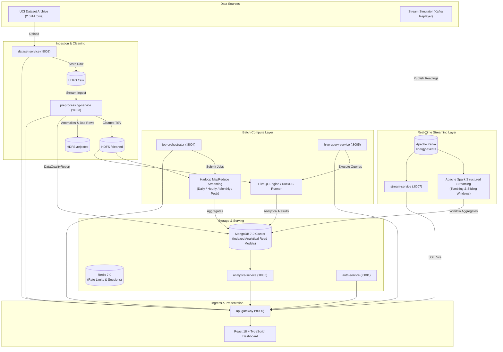

# Architecture Specification: Big Data Energy Consumption Analytics Platform

## 1. Executive Architectural Overview

The Big Data Energy Consumption Analytics Platform is a production-grade, distributed, microservices-based system designed to process, analyze, and visualize high-frequency smart meter readings (based on the UCI Individual Household Electric Power Consumption dataset: ~2,075,259 observations sampled at 1-minute intervals).

The platform implements a **hybrid Lambda/Kappa architectural paradigm**:
- **Batch Processing Layer**: Ingests raw multi-year power telemetry into HDFS (`/user/bda/energy/raw`), scrubs and validates records into an RFC 7807/physics-bounded cleaned layer (`/user/bda/energy/cleaned`), executes distributed MapReduce jobs (Daily, Hourly, Monthly, Peak-Window), and runs analytical HiveQL queries, sinking results into MongoDB.
- **Speed / Real-Time Streaming Layer**: Replays historical readings into an Apache Kafka event bus (`energy-events`), processes sliding and tumbling windows with Apache Spark Structured Streaming, handles late arrivals via watermarking, and pushes real-time metrics to client browsers via Server-Sent Events (SSE).
- **Serving & Presentation Layer**: Eight containerized, non-root microservices fronted by an API Gateway expose RESTful endpoints and SSE streams to a modern React 18 + TypeScript + Vite single-page dashboard.



---

## 2. Microservice Architecture & Service Boundaries

The platform strictly decomposes domain concerns into 8 isolated microservices running non-root Linux containers (`bda:bda` UID 10001) with distinct bounded contexts:

| Service Name | Port | Primary Responsibilities | Data Dependencies |
| :--- | :--- | :--- | :--- |
| **api-gateway** | 8000 | Ingress reverse proxy, token validation, rate-limiting (Redis token bucket), security headers (CSP, HSTS, X-Frame-Options), correlation ID injection (`X-Correlation-ID`). | Redis, Upstream Services |
| **auth-service** | 8001 | Identity management, PBKDF2/Argon2id password hashing, RS256/HS256 JWT access tokens (15m expiry) and refresh tokens (7d), RBAC hierarchy (`ADMIN`, `ANALYST`, `VIEWER`), security audit logging. | MongoDB (`users`, `audit_logs`) |
| **dataset-service** | 8002 | Multipart file upload, SHA-256 integrity verification, schema validation, raw storage persistence to HDFS (`/user/bda/energy/raw`), dataset metadata tracking. | HDFS, MongoDB (`datasets`) |
| **preprocessing-service** | 8003 | Streaming memory-bounded cleaning of UCI data, isolation of `'?'` missing values to `/rejected`, timestamp parsing, physical boundary checks ($V \in [180, 270]$, $kW \ge 0$), DataQualityReport generation. | HDFS, MongoDB (`data_quality_reports`) |
| **job-orchestrator** | 8004 | MapReduce job dispatching, run lifecycle tracking (`PENDING`, `RUNNING`, `COMPLETED`, `FAILED`), deterministic Run ID deduplication, execution metrics, writing output to MongoDB read models. | HDFS, Hadoop CLI, MongoDB (`analytics_jobs`) |
| **hive-query-service** | 8005 | Parameterized HiveQL query engine, injection prevention, AST validation against approved templates, DuckDB vector execution engine over HDFS cleaned TSV data, performance telemetry. | HDFS, DuckDB, MongoDB (`hive_queries`) |
| **analytics-service** | 8006 | High-throughput analytical read models: system KPIs, daily/hourly/monthly consumption trends, peak power alerts, appliance sub-meter breakdowns, BDA project requirement metrics, CSV/JSON exports. | MongoDB (`daily_aggregates`, `hourly_aggregates`, `peak_analyses`) |
| **stream-service** | 8007 | High-speed telemetry ingestion, historical replay simulator, 1-minute tumbling & 5-minute sliding window aggregations, active anomaly detection, Server-Sent Events (SSE) broadcasting. | Kafka, MongoDB (`stream_windows`) |

---

## 3. Data Storage & Tiering Topology

### 3.1 Distributed Filesystem Hierarchy (HDFS)
Data is organized hierarchically to enforce data provenance, immutability, and auditing:

```
/user/bda/energy/
  ├── raw/
  │   └── <dataset_id>/
  │       └── household_power_consumption.txt    <- Immutable original source
  ├── cleaned/
  │   └── <dataset_id>/
  │       └── clean_data.tsv                     <- Tab-delimited, validated, parsed
  ├── output/
  │   └── <job_id>/
  │       └── part-00000                         <- Hadoop MapReduce aggregate output
  └── rejected/
      └── <dataset_id>/
          └── rejected_records.csv               <- Quarantined missing/malformed rows
```

### 3.2 MongoDB Analytical Store (Document Model)
MongoDB 7.0 acts as the high-performance query datastore for pre-computed aggregates, metadata, and audit logs. The collections are indexed with compound keys:

- `users`: `{ username: 1 }` (unique), `{ email: 1 }` (unique), `{ role: 1 }`
- `datasets`: `{ dataset_id: 1 }` (unique), `{ status: 1 }`, `{ created_at: -1 }`
- `data_quality_reports`: `{ dataset_id: 1 }` (unique)
- `analytics_jobs`: `{ job_id: 1 }` (unique), `{ dataset_id: 1, job_type: 1 }`, `{ status: 1 }`
- `daily_aggregates`: `{ dataset_id: 1, date: 1 }` (unique compound), `{ total_kwh: -1 }`
- `hourly_aggregates`: `{ dataset_id: 1, hour: 1 }` (unique compound)
- `monthly_aggregates`: `{ dataset_id: 1, year_month: 1 }` (unique compound)
- `peak_analyses`: `{ dataset_id: 1, timestamp: 1 }` (unique compound)
- `stream_windows`: `{ window_end: -1 }`, `{ anomaly_detected: 1 }` (TTL indexed for auto-expiration)
- `audit_logs`: `{ timestamp: -1 }`, `{ actor_id: 1 }`, `{ action: 1 }`

---

## 4. Compute & Analytical Pipelines

### 4.1 Hadoop MapReduce Architecture
Hadoop Streaming jobs read clean TSV records from HDFS and stream them through UNIX standard I/O pipes:
1. **Daily Aggregates (`jobs/mapreduce/daily/`)**:
   - `mapper.py`: Emits `Date \t Global_active_power,Sub1,Sub2,Sub3,1`
   - `reducer.py`: Accumulates total kWh ($\sum \frac{P_{kW}}{60}$), min/max kW, average kW, sub-meter totals, active appliance energy percentage.
2. **Hourly Diurnal Profile (`jobs/mapreduce/hourly/`)**:
   - `mapper.py`: Extracts hour of day (0-23) and emits `Hour \t Global_active_power,Voltage,Global_intensity,1`
   - `reducer.py`: Computes average hourly load, peak load hour, and baseline night load.
3. **Monthly Trends (`jobs/mapreduce/monthly/`)**:
   - `mapper.py`: Emits `YYYY-MM \t Global_active_power,Sub1,Sub2,Sub3,1`
   - `reducer.py`: Aggregates seasonal monthly consumption and growth trends.
4. **Peak Window Detection (`jobs/mapreduce/peak/`)**:
   - `mapper.py`: Filters records where $P_{active} > \text{Threshold}$ (default $5.0 \text{ kW}$) and emits `Timestamp \t Global_active_power,Sub1,Sub2,Sub3,Voltage`
   - `reducer.py`: Produces peak overload event records with sub-meter attribution (Kitchen vs Laundry vs HVAC).

### 4.2 Apache HiveQL Analytical Engine
Pre-defined analytical queries execute against the external Hive table `household_power_consumption`:
- `01_daily_aggregates.hql`: Daily energy rollups and active energy calculations.
- `02_hourly_profile.hql`: Diurnal peak and baseline profiling across 24 hours.
- `03_monthly_trends.hql`: Long-term multi-year seasonal comparisons.
- `04_peak_power_detection.hql`: Outlier detection above statistical percentiles (95th/99th).
- `05_appliance_energy_breakdown.hql`: Sub-meter 1, 2, 3 vs unmeasured residual consumption.
- `06_voltage_intensity_correlation.hql`: P-V-I electrical relationship verification ($P \approx V \cdot I \cdot \cos\theta$).

### 4.3 Apache Spark Structured Streaming Engine
- **Source**: Kafka topic `energy-events`.
- **Watermarking**: 10-minute watermarking on event timestamp handles out-of-order arrivals.
- **Windowing**: 1-minute tumbling windows and 5-minute sliding windows (slide step 1-minute).
- **Sink**: ForeachBatch idempotent upsert to MongoDB `stream_windows`.

---

## 5. Security Architecture & Threat Defense

1. **Authentication & Identity**:
   - Stateless JWT tokens signed with HMAC-SHA256 (or RS256).
   - Short-lived Access Tokens (15 minutes), Refresh Tokens (7 days) with token revocation in Redis.
   - Passwords hashed using Argon2id ($m=65536, t=3, p=4$) with salt.
2. **Role-Based Access Control (RBAC)**:
   - `ADMIN`: Full administrative control, user provisioning, audit inspection.
   - `ANALYST`: Upload datasets, trigger MapReduce jobs, run HiveQL queries, view analytics.
   - `VIEWER`: Read-only access to dashboards, reports, and streaming feeds.
3. **Network Security & Zero-Trust**:
   - Kubernetes `NetworkPolicy` with `default-deny` on ingress/egress.
   - Microservices communicate via dedicated internal Kubernetes ClusterIP services.
   - Only `api-gateway` is reachable from the Kubernetes Ingress controller.
4. **Input Sanitization & Injection Defense**:
   - Hive queries run strictly through whitelisted, parameterized AST templates.
   - MongoDB queries utilize strongly-typed Pydantic schemas, eliminating NoSQL injection.
   - File uploads validated for MIME type, size limit ($500 \text{ MB}$), and SHA-256 integrity.

---

## 6. Observability & SRE Architecture

- **Prometheus Metrics**: Every microservice exposes a `/metrics` Prometheus endpoint exporting:
  - Standard RED metrics: Request rate (`http_requests_total`), Error rate (by HTTP status), Duration (`http_request_duration_seconds`).
  - Domain-specific metrics: `datasets_uploaded_total`, `mapreduce_jobs_total`, `hive_queries_total`, `stream_records_processed_total`, `stream_anomalies_total`.
- **Structured Logging**: JSON logging with mandatory correlation IDs (`X-Correlation-ID`) propagated across service hops. Sensitive fields (passwords, tokens, credentials) are automatically scrubbed.
- **Health Probes**: Liveness (`/health/liveness`) and Readiness (`/health/readiness`) endpoints on all pods.
