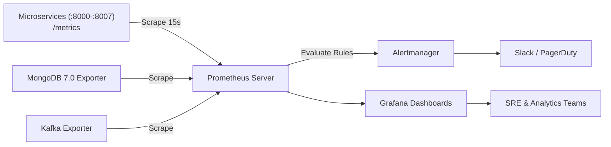

# Observability & Monitoring Specification

## 1. Observability Architecture

The platform provides end-to-end observability across the Golden Signals (Latency, Traffic, Errors, and Saturation):
1. **Prometheus Metrics**: Scraped at 15-second intervals from `/metrics` endpoints across all 8 microservices, MongoDB exporter, Redis exporter, and Kafka JMX exporter.
2. **Alertmanager Alerts**: Automated threshold evaluations triggering alerts for high error rates, job failures, consumer lag, and host exhaustion.
3. **Grafana Dashboards**: Visualizing platform health, business KPIs (kWh totals, peak alerts), and microservice RED metrics.
4. **Structured JSON Logs**: Machine-parseable logs stamped with `X-Correlation-ID` for cross-service distributed transaction tracking.

---

## 2. Core Prometheus Metrics Catalog

### 2.1 Standard RED Metrics
- `http_requests_total{endpoint, method, status}`: Total HTTP requests counter.
- `http_request_duration_seconds{endpoint}`: Request latency histogram (p50, p90, p99).
- `auth_failures_total{reason}`: Authentication rejections counter.

### 2.2 Big Data & Pipeline Domain Metrics
- `datasets_uploaded_total{status}`: Counter of raw dataset ingestions.
- `records_preprocessed_total{status="valid|rejected"}`: Count of records parsed vs quarantined.
- `mapreduce_jobs_total{job_type, status}`: MapReduce job executions (`daily`, `hourly`, `monthly`, `peak`).
- `mapreduce_job_duration_seconds{job_type}`: Execution runtime of Hadoop Streaming tasks.
- `hive_queries_total{template, status}`: Analytical HiveQL executions.
- `hive_query_duration_seconds{template}`: Analytical query latency.
- `stream_records_processed_total`: Count of real-time smart meter telemetry events processed.
- `stream_anomalies_total`: Count of active power spikes exceeding safety thresholds.

---

## 3. Alerting Rules (`infrastructure/monitoring/alerts.yaml`)

| Alert Name | Condition | Severity | Description |
| :--- | :--- | :---: | :--- |
| **HighHttp5xxErrorRate** | Rate of HTTP 5xx errors $> 5\%$ over 5m | Critical | Elevated microservice server failure rate. |
| **MapReduceJobFailed** | Any job transitioning to status `FAILED` | High | Batch compute pipeline error in Hadoop runner. |
| **KafkaConsumerLagHigh** | Consumer lag $> 5000$ messages for 2m | Warning | Spark streaming is falling behind incoming telemetry. |
| **PeakPowerSurgeDetected** | Active power $> 8.0 \text{ kW}$ in streaming window | Info / Warning | Critical household grid load spike detected. |
| **DiskSpaceRunningLow** | Free disk space on HDFS or volume $< 15\%$ | Critical | Storage volume saturation risk. |

---

## 4. Grafana Dashboards

The pre-configured dashboard (`infrastructure/monitoring/grafana-dashboard.json`) includes:
1. **Platform Health & Throughput**: Requests/sec, p95 latencies, active pod count.
2. **Batch Computing Performance**: MapReduce execution times, daily record processing rates.
3. **Analytical Energy KPIs**: Current kWh demand, 24-hour diurnal curve, appliance sub-meter proportions (Kitchen vs Laundry vs HVAC).
4. **Real-Time Telemetry & Anomalies**: Spark streaming window throughput, live active power gauge, alert log.
