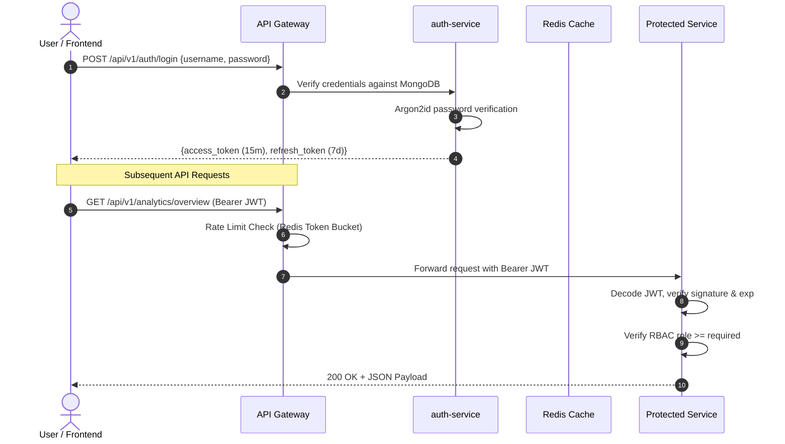

# Security Specification & Defense-in-Depth Guide

## 1. Security Philosophy & Principles

The Big Data Energy Consumption Analytics Platform enforces a rigorous **Defense-in-Depth** and **Zero-Trust** security architecture. Every incoming request is authenticated, authorized, audited, and rate-limited at multiple levels of the stack.

Core Principles:
1. **Least Privilege**: Microservices run as non-root users (`uid: 10001`, `gid: 10001`), database accounts have strict minimal grants, and RBAC governs all endpoints.
2. **Fail-Secure**: Any missing token, invalid signature, or unknown role defaults to rejection (`401 Unauthorized` or `403 Forbidden`).
3. **Defense-in-Depth**: Security controls are applied at Network (Kubernetes NetworkPolicies), Perimeter (API Gateway), Service (JWT validation middleware), and Storage (MongoDB Auth & HDFS permissions) layers.
4. **Non-Repudiation & Auditability**: Every sensitive state change (login, dataset upload, job submission, user creation) emits an immutable audit event to MongoDB with actor ID, IP address, timestamp, and payload metadata.

---

## 2. Authentication & Identity Management

### 2.1 Password Hashing
- Algorithm: **Argon2id** (with PBKDF2-HMAC-SHA256 fallback).
- Parameters:
  - Memory: $65,536 \text{ KiB}$ ($64 \text{ MB}$)
  - Iterations: $3$ passes
  - Parallelism: $4$ threads
- Salt: Cryptographically secure 16-byte random salt generated via `os.urandom(16)`.
- Password Policies: Minimum 8 characters, alphanumeric + special character requirement.

### 2.2 Token Lifecycle & Verification
- **Access Tokens**: Short-lived JSON Web Tokens (JWT) with **15-minute expiry**.
  - Claims: `sub` (User ID), `email`, `role`, `type="access"`, `iat`, `exp`.
  - Signature: HMAC-SHA256 (or asymmetric RS256 in enterprise mode).
- **Refresh Tokens**: Long-lived tokens with **7-day expiry**.
  - Type: `type="refresh"`.
  - Stored securely with revocation capability in Redis.
  - Used strictly at `/api/v1/auth/refresh` to mint new access tokens without re-entering credentials.

---

## 3. Role-Based Access Control (RBAC) Matrix

The system defines 3 hierarchical roles:

| API Action / Resource | Role: VIEWER | Role: ANALYST | Role: ADMIN |
| :--- | :---: | :---: | :---: |
| View System Health & Metrics | Allowed | Allowed | Allowed |
| View Overview Dashboard & Charts | Allowed | Allowed | Allowed |
| View Historical MapReduce Results | Allowed | Allowed | Allowed |
| View Real-Time Streaming SSE Feed | Allowed | Allowed | Allowed |
| Upload Raw Energy Datasets | **Denied** (403) | Allowed | Allowed |
| Trigger Preprocessing Pipeline | **Denied** (403) | Allowed | Allowed |
| Submit MapReduce Analytics Jobs | **Denied** (403) | Allowed | Allowed |
| Execute Analytical Hive Queries | **Denied** (403) | Allowed | Allowed |
| Control Stream Replayer Simulator | **Denied** (403) | Allowed | Allowed |
| User Provisioning & Role Assignment | **Denied** (403) | **Denied** (403) | Allowed |
| View Audit Logs & Security Events | **Denied** (403) | **Denied** (403) | Allowed |

---

## 4. Perimeter & API Gateway Defenses

### 4.1 Security Headers
The API Gateway automatically injects hardened HTTP headers on all responses:
- `Content-Security-Policy`: `default-src 'self'; script-src 'self'; object-src 'none'; frame-ancestors 'none';`
- `Strict-Transport-Security`: `max-age=31536000; includeSubDomains; preload`
- `X-Frame-Options`: `DENY` (clickjacking prevention)
- `X-Content-Type-Options`: `nosniff` (MIME-sniffing prevention)
- `Referrer-Policy`: `strict-origin-when-cross-origin`
- `Permissions-Policy`: `geolocation=(), camera=(), microphone=()`

### 4.2 Rate Limiting
- Algorithm: **Token Bucket** backed by Redis.
- Default Tier: $120 \text{ requests/minute}$ per IP address.
- Sensitive Endpoints (`/api/v1/auth/login`): $10 \text{ requests/minute}$ per IP to prevent brute-force attacks.
- Response: HTTP 429 Too Many Requests with `Retry-After` header.

---

## 5. Input Validation & Injection Prevention

1. **SQL / HiveQL Injection**:
   - Freeform, untrusted SQL strings are strictly prohibited.
   - `hive-query-service` restricts execution to a whitelist of approved parameterized query templates (`01_daily_aggregates`, etc.).
   - Query parameters (dates, thresholds, appliance IDs) are strictly validated using Pydantic regex patterns (`^\d{4}-\d{2}-\d{2}$`).
   - Query strings are scanned for blacklisted tokens (`DROP`, `DELETE`, `TRUNCATE`, `ALTER`, `UNION`, `INTO OUTFILE`, `;`, `--`).
2. **NoSQL Injection**:
   - MongoDB queries avoid raw `$where` or JavaScript evaluation.
   - All filter parameters are strongly typed via Pydantic schemas.
3. **Data Preprocessing & Physics Validation**:
   - Missing data markers (`?`) are parsed and quarantined to `/rejected` rather than contaminating numeric calculations.
   - Voltage must strictly reside in physical ranges ($180.0 \le V \le 270.0$).
   - Active and reactive powers must be non-negative ($P \ge 0, Q \ge 0$).

---

## 6. Container & Platform Hardening

- **Non-Root Execution**: Container images run under unprivileged user `bda` (UID `10001`, GID `10001`).
- **Read-Only Root Filesystems**: Kubernetes manifests enforce `readOnlyRootFilesystem: true` with ephemeral `tmpfs` mounts for temporary scratch files.
- **Drop All Capabilities**: SecurityContext specifies `capabilities: drop: ["ALL"]` and `allowPrivilegeEscalation: false`.
- **Zero-Trust Network Policies**: Inter-pod communication is denied by default; explicit ingress rules permit only `api-gateway` to talk to microservices, and microservices to MongoDB/Redis/Kafka.
