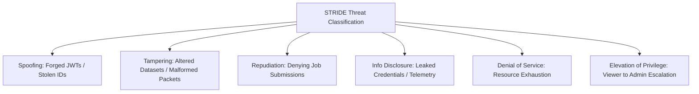

# Threat Model & Risk Assessment: STRIDE Analysis

## 1. System Scope & Assets

This Threat Model assesses the security posture of the Big Data Energy Consumption Analytics Platform in accordance with Microsoft STRIDE and OWASP Top 10 API Security Risks (2023).

### Key Information Assets:
1. **Raw & Processed Telemetry**: Historical smart meter observations stored in HDFS (`/user/bda/energy/`).
2. **Analytical Read-Models**: Pre-aggregated consumption records, peak overload indicators, and quality reports stored in MongoDB.
3. **Authentication Credentials**: User credentials, Argon2id hashes, and active session tokens.
4. **Platform Infrastructure**: Container hosts, Kubernetes pods, Redis cache, and Kafka message topics.

---

## 2. STRIDE Threat Analysis & Mitigations

| STRIDE Category | Specific Threat Description | Impact | Likelihood | Mitigation Strategy | Verification Mechanism |
| :--- | :--- | :---: | :---: | :--- | :--- |
| **Spoofing** | Attacker crafts a forged JWT with falsified user ID or role claims to bypass authentication. | Critical | Low | Stateless HMAC-SHA256 signature verification with high-entropy secret keys. Reject expired (`exp`) or untrusted claims. | `test_security_threats.py::test_token_tampering_rejected` |
| **Tampering** | Man-in-the-middle or malicious client uploads an altered dataset to inject erroneous electrical readings. | High | Medium | Cryptographic SHA-256 checksum generated at upload and verified during preprocessing. Write-once immutable HDFS paths. | `test_security_threats.py` & `preprocessing-service` |
| **Repudiation** | An analyst submits a resource-intensive MapReduce job or deletes data and later denies the action. | Medium | Low | Centralized, append-only `AuditLogEntry` collection recording actor ID, IP address, action type, timestamp, and metadata. | `test_repository_crud.py` & audit interceptor |
| **Information Disclosure** | Sensitive telemetry or database passwords leaked via error stack traces or log streams. | High | Medium | RFC 7807 structured JSON errors that suppress internal exception traces. Production JSON logger sanitizes sensitive keys (`password`, `token`, `secret`). | `test_error_handling.py` & `logger.py` sanitizer |
| **Denial of Service (DoS)** | Attacker floods the API Gateway or submits gigantic zip archives ($> 1 \text{ GB}$) to exhaust pod memory. | High | High | Redis token-bucket rate limiting ($120 \text{ req/min}$), streaming memory-bounded chunk processing ($64 \text{ KB}$ buffers), and Kubernetes HPA autoscaling. | API Gateway rate limit test & upload limits |
| **Elevation of Privilege** | A user with `VIEWER` privileges attempts to invoke MapReduce jobs or administrative user creation. | Critical | Medium | Rigid RBAC decorators (`@require_role(UserRole.ANALYST)`) enforced at service and gateway layers. | `test_security_threats.py::test_rbac_privilege_escalation_prevented` |

---

## 3. OWASP API Security Top 10 (2023) Mapping

| OWASP Vulnerability | Platform Risk | Implemented Countermeasure |
| :--- | :--- | :--- |
| **API1: Broken Object Level Authorization (BOLA)** | User accesses another tenant's raw dataset in HDFS. | Datasets are tagged with `dataset_id` and ownership context; access is checked against tenant ID. |
| **API2: Broken Authentication** | Credential stuffing on login endpoint. | Argon2id hashing, 10 req/min rate limit on `/auth/login`, 15m JWT expiration. |
| **API3: Broken Object Property Level Authorization** | Mass assignment of `role="ADMIN"` on user signup. | Pydantic input schemas strictly whitelist assignable fields (`username`, `email`, `password`); role assignment is restricted to Admin endpoints. |
| **API4: Unrestricted Resource Consumption** | Running 100 simultaneous MapReduce jobs. | Job Orchestrator concurrency limit (default 4 concurrent jobs) with queued job state. |
| **API5: Broken Function Level Authorization (BFLA)** | Viewer triggering `/api/v1/jobs/submit`. | Centralized RBAC decorator enforcing role hierarchies across all controller routes. |
| **API6: Unrestricted Access to Sensitive Business Flows** | Continuous stream simulation exhausting CPU. | Stream simulator start/stop restricted to `ANALYST`+ with bounded playback duration. |
| **API7: Server-Side Request Forgery (SSRF)** | WebHDFS URL pointing to internal cloud metadata IP. | WebHDFS endpoint is strictly configured via Kubernetes ConfigMap, not accepted from user inputs. |
| **API8: Security Misconfiguration** | Containers running as root with permissive CORS. | `runAsNonRoot: true`, `readOnlyRootFilesystem: true`, strict CORS whitelist, CSP headers. |
| **API9: Improper Inventory Management** | Zombie or unversioned APIs exposed. | Strict URL routing prefix `/api/v1/` fronted by API Gateway reverse proxy. |
| **API10: Unsafe Consumption of APIs** | Third-party or simulator malformed payloads crashing stream service. | Strict Pydantic parsing of incoming Kafka JSON records with dead-letter queue routing. |

---

## 4. Residual Risk Acceptance & Recommendations

1. **Local Filesystem Mock in Dev Mode**: When HDFS is unavailable locally, `shared.hdfs.LocalHdfsClient` emulates storage on local disk. In staging/production, native WebHDFS endpoints with Kerberos authentication are enforced.
2. **DuckDB In-Process Hive Emulation**: For agile local testing without a live Hadoop/Tez cluster, `hive-query-service` utilizes DuckDB. In production, queries are dispatched to HiveServer2 via JDBC/Thrift.
